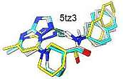
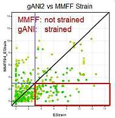
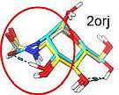

# g_ANI

g_ANI contains a reimplementation of the ANI Neural Net Potential developed at Genentech.
It also contains a command line tool [sdfNNPConfAnalysis.pl](iscripts/sdfNNPConfAnalysis.pl)
computes the strain in a small molecule ligand conformation. This allows the computation of strain energy with QM accuracy in just a few minutes on a GPU while analyzing hundredths of conformations.

Relevant references are:
   - [ANI-1: an extensible neural network potential with DFT accuracy at force field computational cost](https://pubs.rsc.org/en/content/articlelanding/2017/SC/C6SC05720A)
   - [TorchANI: A Free and Open Source PyTorch-Based Deep Learning Implementation of the ANI Neural Network Potentials](https://pubs.acs.org/doi/10.1021/acs.jcim.0c00451)
   - [chemalot and chemalot_knime: Command line programs as workflow tools for drug discovery](https://jcheminf.biomedcentral.com/articles/10.1186/s13321-017-0228-9)
   - [Conformational energy penalties of protein-bound ligands.](https://link.springer.com/article/10.1023/A:1008007507641)

## Installing
   - Install git large file support:
     ```
     git lfs install
     ```
   - clone these three packages into one directory
     ```
        git clone https://github.com/Genentech/cdd_chem.git
        git clone https://github.com/Genentech/t_opt.git
        git clone https://github.com/Genentech/g_ani.git
      ```
  - install the tools from the [Autocorrelator](https://github.com/chemalot/autocorrelator) package and make sure they are available on your path.
  - install the tools from the [Chemalot](https://github.com/chemalot/chemalot) package and make sure they are available on your path.
  - create the conda package
   
     You might need to issue `conda config --set channel_priority strict`
     ```
     cd g_ani
     conda env create --file requirements_dev.yaml -n g_ANI
     ```
   - activate the conda package:
      ```
      conda activate g_ANI
      ```
   - Install the auxiliary packages in development mode as long as you are developing:
      ```
      cd ../cdd_chem/
      pip install -e .
      cd ../t_opt/
      pip install -e .
      ```
   - To run the strain energy calculation you need the following tools from [OpenEye](https://www.eyesopen.com/).<br/>
     Note: you can run minimizations u
     sdfMOptimizer.py and single point calculations with sdfNNP.py without openeye tools
           or licenses as the cdd_chem package will use RDKit if OEChem is not available.
   
       - omega
       - szybki

   - All NNP calculations will run significantly faster if you have a GPU available on your computer. If a GPU is not available the slower
   - 
   -   CPU implementation will be used.

   - You will need a ~8GB of memory to run the example below. Be aware that to little memory will cause errors with unexpected messages.
   - Run test example:
   ```
   scripts/sdfNNPConfAnalysis.pl -in tests/data/CCCC.sdf -out out.sdf -sampleOtherMin
   ```
   The input file contains two conformations of butane. The output file will contain 16 conformations. 8 for each input conformation evaluating the strain and highlighting the areas of the input conformation with the highest strain (cf. below).

## Strain Energy Calculation
### Method
This implementation follows the definition by Boström et.al. (Conformational energy penalties of protein-bound ligands, JCAMD 1998).

- A conformational search is performed by enumerating conformers with omega and minimizing them with the NNP. By default up to 650 conformations are enumerated to be complete.
- The conformation with the lowest energy is identified and defines the **"global minimum"** conformation. All energies reported are relative to this conformation.
- The input conformation is minimized to yield the **"local minimum"**
- The hydrogens are minimized on the input conformation to yield the **"Hydrogen optimized""** conformation (HOpt).
- The hydrogen optimized conformation is optimized using 4 decreasing quadratic retaining potentials. This will yield conformations with increasing relaxation and decreasing relative energy. The relaxation will happen along the most constrained part of the molecule, thus highlighting areas of strain. These are the **"constrained minima"**
- If the `-sampleOtherMin` option is given **"Other minima"** are returned. these minima are on a pareteo minimum curve that optimizes RMSD or relative energy. These allow the identification of minima that are similar to the input conformation and have low relative energy or low RMSD.

By looking at the conformations from first to last the relaxation along the most strained features of the input conformations can be identified. Order is as follows:

1. Input Conformation
2. Hydrogen atoms optimized input (Hopt)
3. 4 constrained minimized conformation with decreasing constrains
4. Local minimum
5. Global minimum<br/>
   The global minimum will frequently be ill aligned to the input conformation as it will generally have a very different conformation.
6. Other minima (as described above)<br/>
   These minima should be evaluated to see if there are minor changes that preserve the overall structure but largely reduce the strain.
   
The output file will contain the following fields:

   - **type** one of the following specifying the type of this conformer (cf. above):<br/>
      input, H Opt, cstr 50, cstr 10, cstr 2, cstr 0.4, loc Min, glb Min, oth *
   - **inRMSD** rmsd of this conformation to the input conformation [A]
   - **deltaE** relative energy of this conformation ot the global minimum [kcal/mol]
   - **NNP_Energy_kcal_mol** absolute energy of this conformation as computed with the g_ani NNP.

### Example

The following ligand conformation was retrieved from the PDB ([5BVF](https://www.rcsb.org/structure/5BVF)) of a small molecule bound to ERK2. This is one of the few compound that is bound in what is deemed a high energy conformation.


<br/>Ligand bound to ERK2 in 5VFB
<table><tr><td align="center"></td>
           <td align="center"></td></tr>
       <tr><td align="center">Strain analysis animation</td>
           <tdalign="center">Strain analysis animation with overlay of input</td></tr>
       <tr><td colspan='2'>
         Result of strain energy computation on the ligand in 5BVF. As can be seen the largest train is on the phenyl ring on the right. It clearly relaxes from the position in the input conformation to the conformation in the constraint minima (cnst 0.4). Note that the global minimum exhibits an intramolecular hydrogen bond. The energy of the global minimum is probably not reflective of the energy in solution phase as the NNP was trained on gas phase DFT calculations. Thus the strain in this calculation might be overestimated.</br>
         RMSD to Input [A]. Relative Energy (dE) to Global Minimum [kcal/mol]</td></tr></table>
           
### Explanation
The constraint minimization account for multiple non-physical sources of strain:

- Differences between the method used to generate the input conformation and the NNP used in evaluating the strain. Small changes in the bond length deemed to be optimal between two atoms would yield very high energy differences. Allowing the slight relaxation will remove this artifact.
- Molecular flexibility of the protein and ligand always allow for some movement.
- Crystal structure refinement has an intrinsic uncertainty.

### Statistics

We have computed the strain energy with the this method for 750 neutral ligands from PDB database with good resolution.
The following boxplot shows the distribution of the strain energy of these 750 conformations for different values of maximum relaxation. E.g. the box at 0.4 A maxRMSD was computed by applying the method described above. For each of the 750  input conformation. Only conformations within 0.4 A were retained and the lowest relative energy is reported.


As can be expected the more relaxation is allowed the lower the strain energy is. In looking at many strain energy calculation we have determined that a relaxation of 0.4 A results in a conformation that is very close to the input conformation but in which many artifacts causing strain have been released. We therefore recommend looking at the energy of the conformations with less than 0.4 A deviation from the input first. If the lowest energy of these conformation is below 2-3 kcal/mol the conformation is considered to have a low strain energy. For conformations with strain energies at 0.4A > 3 kcal/mol we recommend looking at the relaxation pattern and  trying to understand which parts of the molecule are contributing most to the strain. Structural changes to the molecule should be considered to reduce the strain. The statistics above suggest that compounds with strains (at 0.4A) > 2-3kcal/mol have a small likelihood of being consistent with crystallographically observed conformations.

### Comparison to force field based implementation
We ran the same strain energy computation using the MMFF94S force field using the sheffield solvation model instead of the NNP on the 750 conformation form the PDB described above. The following graph compares the results:


As expected both method classify most conformations from the pdb as low strained. However, for some conformations differences highlight limitations of either method.
<table>
 <tr><th colspan='4'>Conformations strained according to MMFF94 but not strained according to g_ANI</th></tr>
 <tr>
  <td></td>
  <td></td>
  <td></td>
  <td></td>
 </tr>
 <tr>
 <td><pre>              </pre>
     </td>
  <td>In the crystallographic pose of 5jn8 the carbonyl oxygen is pointing towards the thiadiazole sulfur. This conformation is stabilized by the favorable O-S interaction. This is reproduced by g_ANI but not by MMFF94S. It is well known that O-S interactions are frequently seen as repulsive by force fields.</td>
  
  <td>In case of the 4dvi ligand both the g_ANI and the MMFF94 conformations differ from the crystallographic conformation on the central phenyl ring. The energy difference for the g_ANI conformation is computed to be just 0.1 kcal/mol while the MMFF94 Force Feld predicts a difference of 6 kcal/mol.</td>
  
  <td>For 5tz3 both the g_ANI and the crystallographic conformations are mostly planar with a hydrogen bond between the amide NH and the 5 membered ring nitrogen. In the MMFF94S conformation this interaction is not made and the conformation is twisted out of plane. Our assumption is that the hydrogen bonding conformation is to strained in the MMFF94S computation due to the close distance required by the rigid backbone of the compound.</td>
 </tr></table>
 
<table>
 <tr><th colspan='4'>Conformations strained according to g_ANI but not strained according to MMFF94</th></tr>
 <tr>
  <td></td>
  <td><pre>    </pre></td>
  <td><pre>    </pre></td>
  <td><pre>                          </pre>
     </td>
 </tr>
 <td><pre>              </pre>
    </td>
  
 <td colspan='2'>For 2ori and 5lrd the g_ANI minimum conformation deviates significantly from the crystallographic conformation and makes an intramolecular hydrogen bond. The strength of this hydrogen bond is overestimated by g_ANI as the NNP was trained on gas phase DFT energies.
</td>
 
 <td>The g_ANI and MMFF94S conformation of 5xs2 differ in the orientation of the amide group. Both conformations are difficult to differentiate based on the electron density. The conformation predicted by g_ANI however places the carbonyl oxygen next to the electropositive hydrogen no the pyrrole N. QM calculations at the DFT level show a ~ 8kcal/mol preference for the carbonyl oxygen pointing towards the NH.</td>
 </tr>
</table>

## NNP implementations in g_ANI

### ANI type NNP
The [ml_am/nn](ml_qm/nn) package includes an independent implementation of the ANI network. Using the [TorchAnI](https://github.com/aiqm/torchani) implementation might be a better choice development on this implementation has slowed somewhat. The g_ANI implementation has been fully tested and is currently in production use for computing strain energy at GNE. Weights trained on the ANI2 data set are provided in this package (cf. below). The configuration of the NNP is driven by a [json](data/nnp/ani22/bb/bb.3.json) configuration file. The production implementation uses an ensemble of 8 networks with four layers each for each atom type.

### DistNet NNP

This implementation uses a novel architecture in which the Behler Parrinello descriptors are learned. Atom types are described by one hot encoding their atomic number and group in the periodic system:
|Atom|Period 1| P2 | P3 | Group 1 | G4 | G5 | G6 | G7 |
|----|--------|----|----|---------|----|----|----|----|
| H  |   1    | 0  |  0 |    1    |  0 | 0  | 0  | 0  |
| C  |   0    | 1  |  0 |    0    |  1 | 0  | 0  | 0  |
| N  |   0    | 1  |  0 |    0    |  0 | 1  | 0  | 0  |
| O  |   0    | 1  |  0 |    0    |  0 | 0  | 1  | 0  |
| F  |   0    | 1  |  0 |    0    |  0 | 0  | 0  | 1  |
| S  |   0    | 0  |  1 |    0    |  0 | 0  | 1  | 0  |
| Cl |   0    | 0  |  1 |    0    |  0 | 0  | 0  | 1  |

The NNP contains three separate networks, 
the [RadialNet](https://github.com/Genentech/g_ani/blob/26b38ab3d68e4ff4e837927646f4cde894582a3b/ml_qm/distNet/dist_net.py#L260), 
the [AngleNet](https://github.com/Genentech/g_ani/blob/26b38ab3d68e4ff4e837927646f4cde894582a3b/ml_qm/distNet/dist_net.py#L462) 
and the [EnergyNet](https://github.com/Genentech/g_ani/blob/26b38ab3d68e4ff4e837927646f4cde894582a3b/ml_qm/distNet/dist_net.py#L59).


The AngleNet uses a concatenation of the Atom types of three atoms. The distances between the first (center) atom and two neighbors as well as the angle is included in each input row. The input to the radial net is similar but includes just two atoms and one distance. A cutoff function is used similar to the one used on the output of the RadialNet and AngleNet similar to the one used in the ANI NNP. The EnergyNet is similar in function and structure as one Atomic Network of the ANI NNP. A yaml file for a configuration of DistNet is given [here](data/nnp/dist3/d3.yml).

This Network topology has advantages and disadvantages:

Advantages:
- Uses a single network for all atom types. Thus the network size does not necessarily grow with the third power of supported atom types.
- Fewer parameter due the use of one single EnergyNet.
- In our first preliminary results a slight performance boost is observed. Note that this need further validation.

Disadvantages:
- The current implementation is 6-7 times slower than the g_ANI implementation. Given the more complex functional form as compared to using Behler Parrinello type description possible improvements might be limited.
- This is not as well tested as the g_ANI NNP.

### Weights for the NNP described

Weights for the g_ANI network can be found in the [data/nnp/ani22/bb](data/nnp/ani22/bb/) directory. Eight Models were optimized using BOHB and can be used as an ensemble by specifying the [bb3.json](data/nnp/ani22/bb/bb.3.json) configuration file. Each model was trained on a different randomly selected 80% of the ANI2 dataset. Note that models differ in number of nodes and other parameters. This was done to increase the diversity of the network in the hope of improving the accuracy of the error estimate.

Weights for one DistNet NNP are available in [data/nnp/dist3/](data/nnp/dist3/). It can be used with the command line tools by specifying the [data/nnp/dist3/d3.yml](data/nnp/dist3/d3.yml) as configuration option. Note that because this is not an ensemble model no uncertainties can be computed.


## Credits
g_ANI was created with the help and input of many colleagues at Genentech and outside of Genentech.
I would like to acknowledge their contribution and thank them for all the input and help!
|                        |                       |
|------------------------|-----------------------|
| Man-Ling Lee           |   Adrian Roitberg     |
| Ben Sellers            |   Justin Smith        |
| Petr Votava            |   David Mobley        |
| Jeff Blaney            |   Lee-Ping Wang       |
| Andrew Whitehead       |   Olexandr Isayev     |
| Andrey Shaw            |   Peter Eastman       |
| Dan Ortwine            |                       |
| Erik Evensen           |                       |
| Erin Chistensen        |                       |
| Kai Liu                |                       |
| Laura Kahn             |                       |
| Richard Bone           |                       |
| Robert Woodruff        |                       |
| Ryan Weekly            |                       |
| Slaton Lipscomb        |                       |
 
